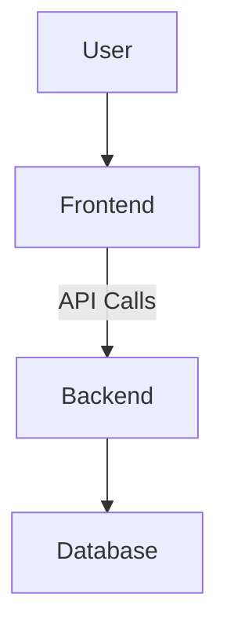
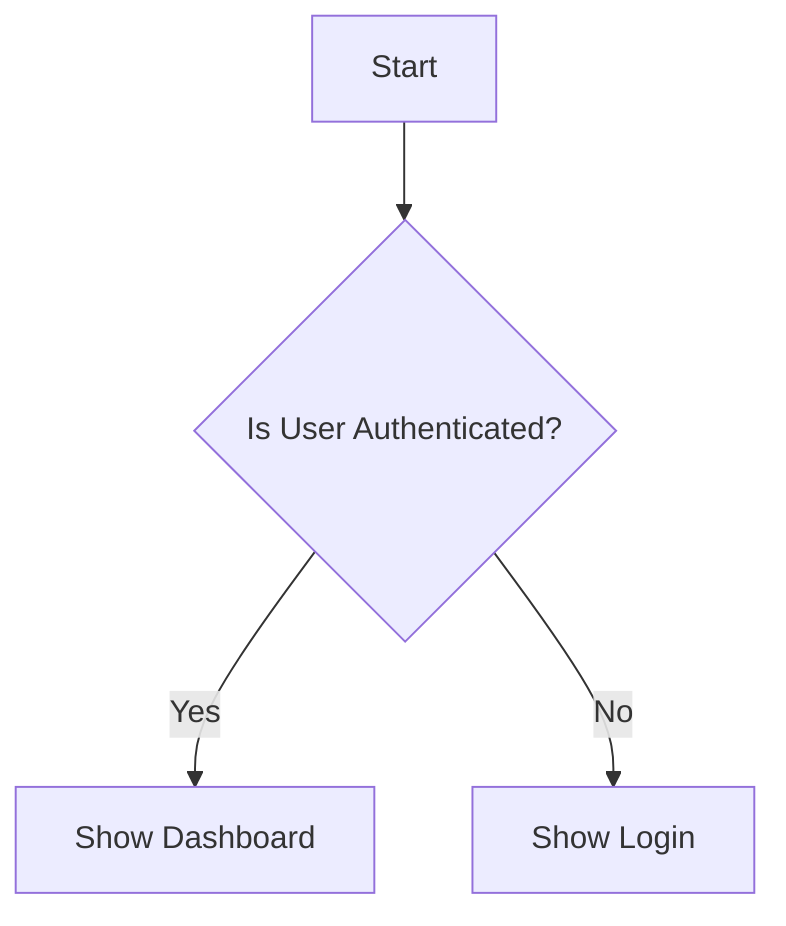

# Project Overview
This project provides secure management of tasks with real-time collaboration features.

# Architecture

# Features
- Secure task management
- Real-time collaboration
- User authentication

# Activity/Flow Diagram

# Getting Started
To get started with this project:
1. Clone the repository.
2. Set up the environment variables.
3. Run the development server.
