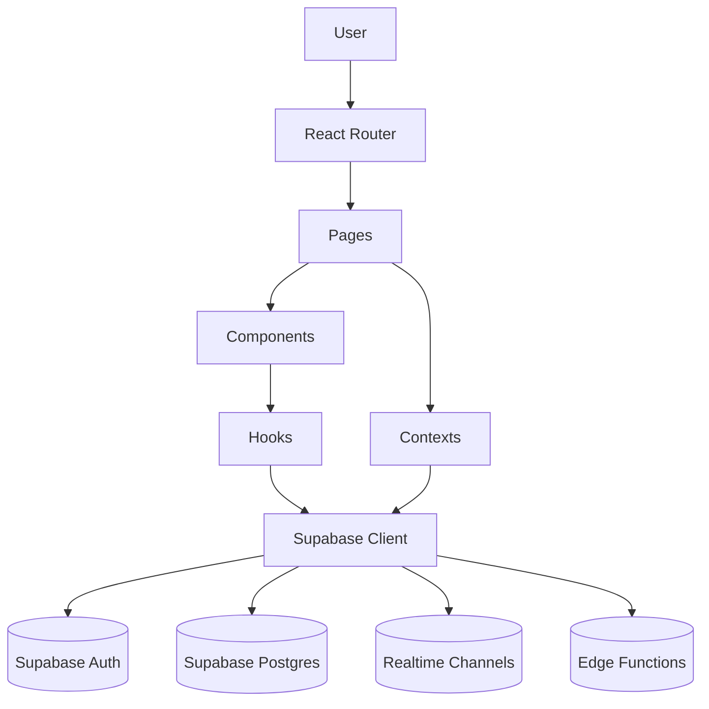
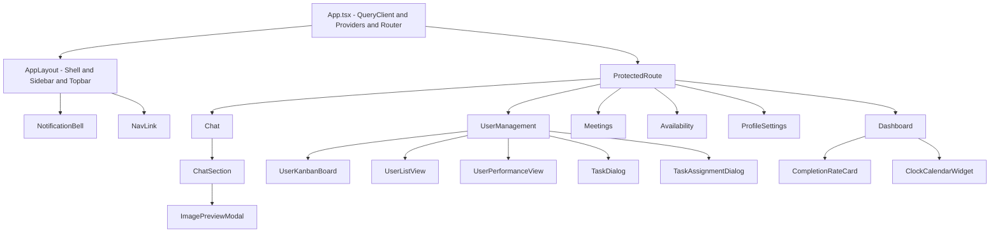
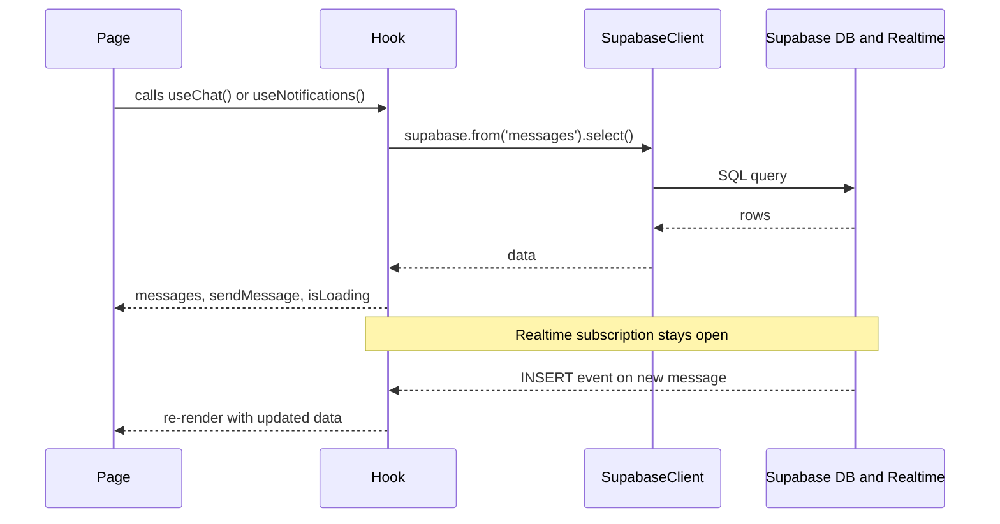
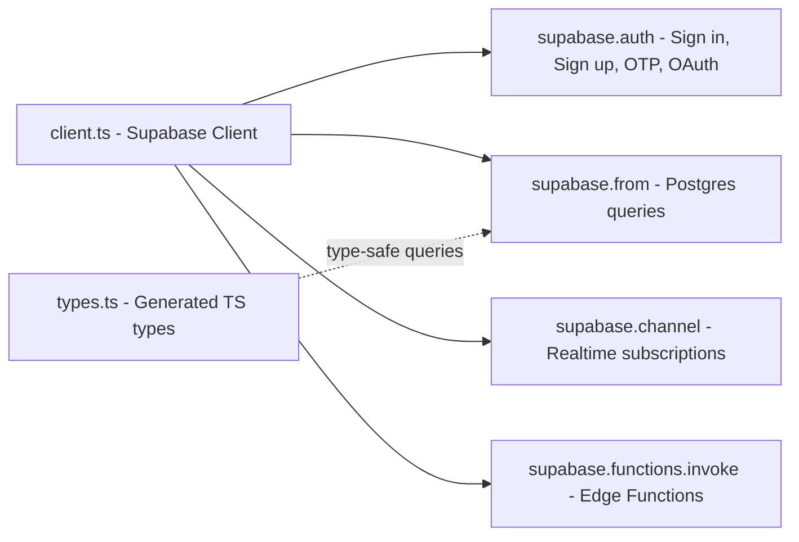

# SecureTask Hub

> **Secure, real-time task collaboration — built for teams that move fast and protect what matters.**

SecureTask Hub is a full-stack productivity platform that brings secure task management and real-time team collaboration into one seamless experience. Built with a modern **React + TypeScript** frontend powered by **Vite**, and backed by **Supabase** for authentication, live database queries, and serverless edge functions — the app is designed for teams who need role-based access control, live updates, and a polished interface without sacrificing security. Whether you're managing tasks on a Kanban board, coordinating meetings, or chatting with your team in real time, SecureTask Hub keeps everything organized, auditable, and fast.

---

## Features

- **Secure Authentication and RBAC** — Email/password, Google OAuth, and OTP-based login flows. Role-based access control gates sensitive pages, with admin actions verified via Supabase Edge Functions.
- **Task Management** — Create, assign, and track tasks via dialogs. View tasks in a Kanban board or sortable list — whichever suits your workflow.
- **Real-Time Chat** — Full-featured chat with message threads, image attachments, and live Supabase Realtime subscriptions so messages appear instantly across all clients.
- **Meetings and Availability** — Schedule and manage meetings, set availability windows, and coordinate team schedules from dedicated pages.
- **Live Notifications** — A `NotificationBell` component listens to real-time channels and surfaces unread alerts with a badge — no refresh needed.
- **Performance Analytics** — `UserPerformanceView` and `CompletionRateCard` surface task completion metrics and team performance at a glance.
- **Theme Support** — System-aware light/dark mode via `ThemeContext`, persisted across sessions.
- **Rich UI Design System** — 40+ shadcn/ui + Radix UI primitives for a consistent, accessible interface.

---

## High-Level Architecture

The frontend is a React + TypeScript SPA bundled by Vite, routed via React Router, and powered by TanStack React Query for server-state management. All backend services are handled by Supabase.



---

## Auth and App Flow

When the app loads, `AuthProvider` initializes the session. Authenticated users are routed to protected pages; unauthenticated users land on public routes.

```mermaid
flowchart TD
    A([App Loads]) --> B[AuthProvider initializes session]
    B --> C{Authenticated?}

    C -- No --> D[Public Routes]
    D --> D1["Landing Page"]
    D --> D2["Login"]
    D --> D3["Register"]

    C -- Yes --> E[ProtectedRoute Guard]
    E --> F["Dashboard"]
    E --> G["Chat"]
    E --> H["Meetings"]
    E --> I["Availability"]
    E --> J["Profile"]
    E --> K["User Management (Admin only)"]

    C -- Unknown --> L["404 Not Found"]
````

---

## Authentication Flows

SecureTask Hub supports multiple authentication strategies, managed through `AuthContext`.

```mermaid
flowchart LR
    U([User]) --> EP[Email and Password]
    U --> GO[Google OAuth]
    U --> OTP[OTP Login]

    EP --> SB[(Supabase Auth)]
    GO --> EF[Edge Function Role Check]
    EF --> SB
    OTP --> SB

    SB --> SS[Session Created]
    SS --> LS[LocalStorage Updated]
    SS --> AC[AuthContext Updated]
    AC --> PR[ProtectedRoute Enabled]
```

---

## Frontend Component Architecture



---

## Real-Time Data Flow

How hooks fetch data and keep it live via Supabase Realtime subscriptions.



---

## Supabase Integration Layer



---

## Getting Started

### Prerequisites

- Node.js 18+
- A [Supabase](https://supabase.com) project

### Setup

1. **Clone the repository**
   ```bash
   git clone <repo-url>
   cd securetask-hub
   ```

2. **Install dependencies**
   ```bash
   npm install
   ```

3. **Configure environment variables**

   Create a `.env` file at the project root:
   ```env
   VITE_SUPABASE_URL=your_supabase_project_url
   VITE_SUPABASE_ANON_KEY=your_supabase_anon_key
   ```

4. **Start the development server**
   ```bash
   npm run dev
   ```
   Open [http://localhost:5173](http://localhost:5173) in your browser.

---

## Project Structure

```
.
├── src/
│   ├── main.tsx                # App entry point
│   ├── App.tsx                 # Providers + routing
│   ├── pages/                  # Route-level screens
│   ├── components/             # Reusable UI + feature components
│   │   └── ui/                 # shadcn/ui + Radix primitives
│   ├── contexts/
│   │   ├── AuthContext.tsx     # Session, auth methods, RBAC
│   │   └── ThemeContext.tsx    # Light/dark mode
│   ├── hooks/
│   │   ├── useChat.ts
│   │   ├── useNotifications.ts
│   │   └── useUserRole.ts
│   ├── integrations/
│   │   └── supabase/
│   │       ├── client.ts       # Supabase client instance
│   │       └── types.ts        # Generated DB types
│   └── lib/
│       └── utils.ts
├── index.html
├── vite.config.ts
├── tailwind.config.ts
└── tsconfig.json
```

> For a deep-dive into every file, see [`src/README.md`](./src/README.md).

---

## Tech Stack

| Layer | Technology |
|---|---|
| UI Framework | React 18 + TypeScript |
| Bundler | Vite |
| Routing | React Router v6 |
| Server State | TanStack React Query |
| Styling | Tailwind CSS + shadcn/ui + Radix UI |
| Backend | Supabase (Auth, Postgres, Realtime, Edge Functions) |
| Auth Flows | Email/Password, Google OAuth, Email OTP, Phone OTP |

---

*Built with React, TypeScript, Vite, Tailwind CSS, and Supabase.*
