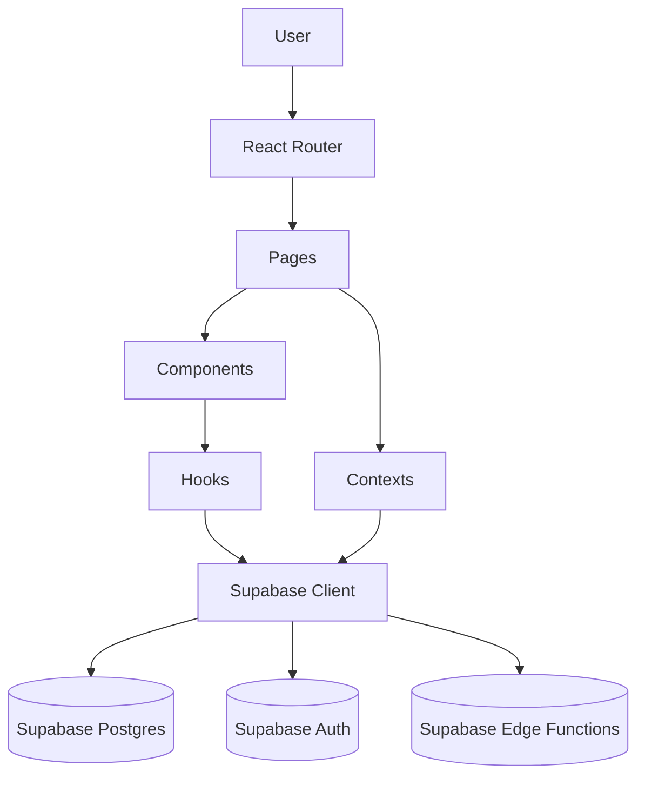
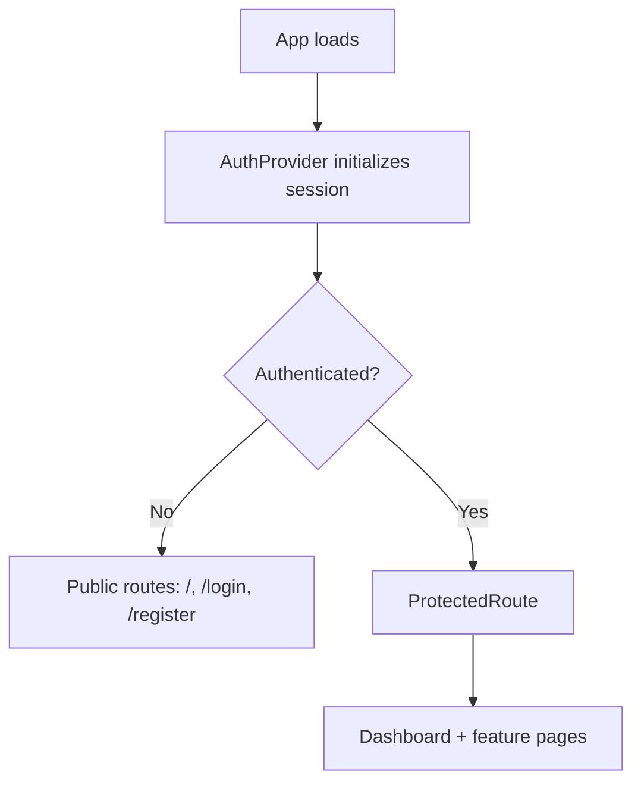

# `src/` — Codebase Overview

This folder contains the client-side application for **SecureTask Hub**, built with **React + TypeScript**, bundled by **Vite**, styled with **Tailwind/shadcn-ui**, and backed by **Supabase** (Auth, Postgres, Realtime/Functions). The app is routed using **React Router**, uses **TanStack React Query** for server state, and centralizes authentication logic via `AuthContext`.

---

## High-level architecture (frontend)

---

## App flow (auth + protected routes)

---

## Top-level files in `src/`

### `src/main.tsx`
**Entry point**. Boots the React app and mounts it into the DOM (typically `#root` in `index.html`). Usually wraps `<App />` with any strict-mode or global providers if needed.

### `src/App.tsx`
**Application composition + routing.**
- Sets up **React Query** with a shared `QueryClient`.
- Wraps the app with:
  - `ThemeProvider` (theme/dark mode support)
  - `TooltipProvider` (UI tooltips)
  - `AuthProvider` (session + auth methods)
- Declares routes using `react-router-dom`:
  - Public: `/`, `/register`, `/login`
  - Protected (wrapped in `ProtectedRoute`): `/dashboard`, `/user-management`, `/chat`, `/meetings`, `/availability`, `/profile`
  - Catch-all: `*` → `NotFound`

### `src/App.css`
App-level CSS overrides (if any). Often minimal when Tailwind is used.

### `src/index.css`
Global styles (Tailwind base layers, CSS variables, general theming styles).

### `src/vite-env.d.ts`
TypeScript declarations for Vite (e.g., `import.meta.env` typings).

---

## `src/components/`
Reusable UI + feature components used by pages.

### `src/components/AppLayout.tsx`
**App shell/layout.** Typically controls shared layout pieces like sidebar/topbar, page padding, and navigation structure.

### `src/components/ProtectedRoute.tsx`
**Route guard.** Ensures users must be authenticated (and possibly authorized) to access protected pages. Usually:
- Shows loading state while auth is initializing
- Redirects to `/login` if not signed in
- Renders children if allowed

### `src/components/NavLink.tsx`
A small wrapper for navigation links (active styles, consistent behavior across sidebar/nav).

### `src/components/NotificationBell.tsx`
Notification UI (badge, dropdown/list). Often connected to realtime updates + a notifications table/channel.

### `src/components/ChatSection.tsx`
Large feature component for chat UI (threads/messages, input box, attachments, message list, realtime updates).

### `src/components/ImagePreviewModal.tsx`
Reusable modal to preview images (likely used in chat or profile/avatar contexts).

### `src/components/TaskDialog.tsx`
Dialog/modal for creating or editing tasks (form fields, validation, submit handlers).

### `src/components/TaskAssignmentDialog.tsx`
Dialog/modal for assigning tasks to users (selecting assignee(s), confirming assignment).

### `src/components/UserKanbanBoard.tsx`
Kanban-style task visualization for a user/team (columns by status, drag/drop if implemented).

### `src/components/UserListView.tsx`
List/table view of users or tasks (filters, sorting, quick actions).

### `src/components/UserPerformanceView.tsx`
Analytics/metrics UI for user performance (charts, completion rate, etc.).

### `src/components/ClockCalendarWidget.tsx`
Dashboard widget providing time/calendar info.

### `src/components/CompletionRateCard.tsx`
Dashboard metric card—likely shows completion rate using charts or summary numbers.

---

## `src/contexts/`
React Context providers for cross-cutting concerns.

### `src/contexts/AuthContext.tsx`
**Authentication/session state manager** using Supabase:
- Holds `user`, `session`, and `isLoading`
- Provides methods:
  - `signUp(email, password, fullName, role)`
  - `signIn(email, password)`
  - `signInWithGoogle(role?, adminPassword?)` (includes an admin-password verification via an edge function)
  - OTP flows: `sendEmailOtp`, `verifyEmailOtp`, `sendPhoneOtp`, `verifyPhoneOtp`
  - `signOut()`
- Handles:
  - auth state changes (`supabase.auth.onAuthStateChange`)
  - loading an existing session (`supabase.auth.getSession`)
  - applying a pending role after OAuth redirect (via `localStorage`)
  - listening for profile deletion events and forcing logout

### `src/contexts/ThemeContext.tsx`
**Theme handling** (light/dark mode) and persistence. Wraps the app so components can read/update the theme.

---

## `src/hooks/`
Reusable hooks that encapsulate logic.

### `src/hooks/use-mobile.tsx`
Detects mobile viewport / media queries and exposes a boolean (commonly used for responsive layout choices).

### `src/hooks/use-toast.ts`
Toast notification hook (often a wrapper around the UI toast system).

### `src/hooks/useChat.ts`
Chat feature hook: likely manages message fetching, realtime subscriptions, sending messages, attachments, etc.

### `src/hooks/useNotifications.ts`
Notification hook: likely fetches notifications, subscribes to realtime updates, marks read/unread, etc.

### `src/hooks/useUserRole.ts`
Role/authorization helper: fetches current user role (e.g., `admin` vs `user`) from database and exposes it for RBAC decisions in UI.

---

## `src/integrations/`
Third-party/backend integrations (clients, types, adapters).

### `src/integrations/supabase/`
Supabase integration layer.

#### `src/integrations/supabase/client.ts`
Creates and exports the **Supabase client** instance used across the app (configured via env vars). This is the primary way the frontend calls:
- auth (`supabase.auth.*`)
- database (`supabase.from(...)`)
- edge functions (`supabase.functions.invoke(...)`)
- realtime channels (`supabase.channel(...)`)

#### `src/integrations/supabase/types.ts`
Generated TypeScript types for Supabase schema (tables/views/functions). Helps keep DB access type-safe.

---
## `src/pages/`
Route-level screens. Each page is typically mapped to a route in `App.tsx`.

### `src/pages/Index.tsx`
Landing page / entry page (may show marketing, or redirect logic if already authenticated).

### `src/pages/Login.tsx`
Login screen (email/password, OAuth, OTP flows).

### `src/pages/Register.tsx`
Registration screen (creates account, sets profile fields, chooses role if supported).

### `src/pages/Dashboard.tsx`
Main logged-in home screen (widgets, task overviews, stats).

### `src/pages/UserManagement.tsx`
Admin or privileged page for managing users/roles (RBAC).

### `src/pages/Chat.tsx`
Chat page (likely uses `ChatSection` and `useChat`).

### `src/pages/Meetings.tsx`
Meetings scheduling/management page (agenda, minutes-of-meeting, participants, policies).

### `src/pages/Availability.tsx`
Availability management page (user availability, scheduling windows).

### `src/pages/ProfileSettings.tsx`
Profile settings page (name/avatar, auth settings, preferences).

### `src/pages/NotFound.tsx`
404 page for unknown routes.

---

## Where to start reading the code

1. `src/main.tsx` → app bootstrapping  
2. `src/App.tsx` → providers + routing  
3. `src/contexts/AuthContext.tsx` → authentication & RBAC foundation  
4. `src/integrations/supabase/client.ts` → backend connectivity  
5. `src/pages/*` → feature flows  
6. `src/components/*` → reusable building blocks  

---
